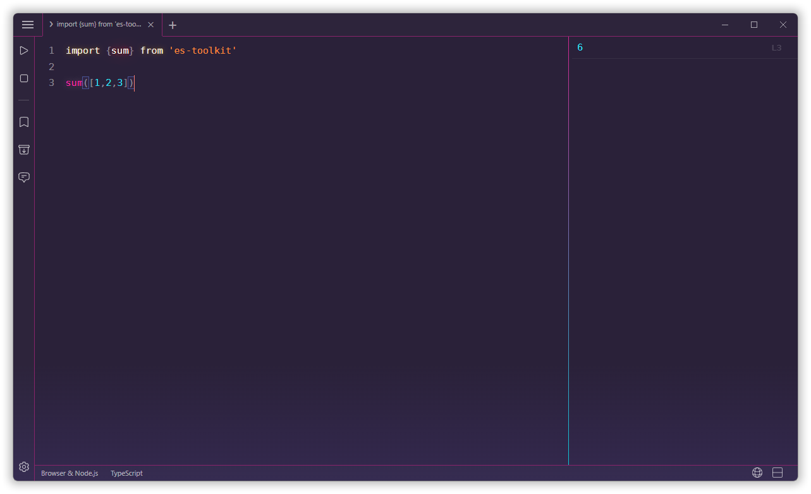

  <a href="https://runjs.app">
    
    <h1 align="center">RunJS</h1>
  </a>

### Activation Instructions

1. Copy `1_app.asar` to `<installation directory>/resources/app.asar`, replacing the existing file.
2. Activate the application using any random license key with at least **40 characters**.
3. Close the application.
4. Copy `2_app.asar` to `<installation directory>/resources/app.asar`, replacing the existing file.

### Developer Notes

- Delete the `node_modules` directory before packaging.
- Use `Terser` to minify the JavaScript files.

